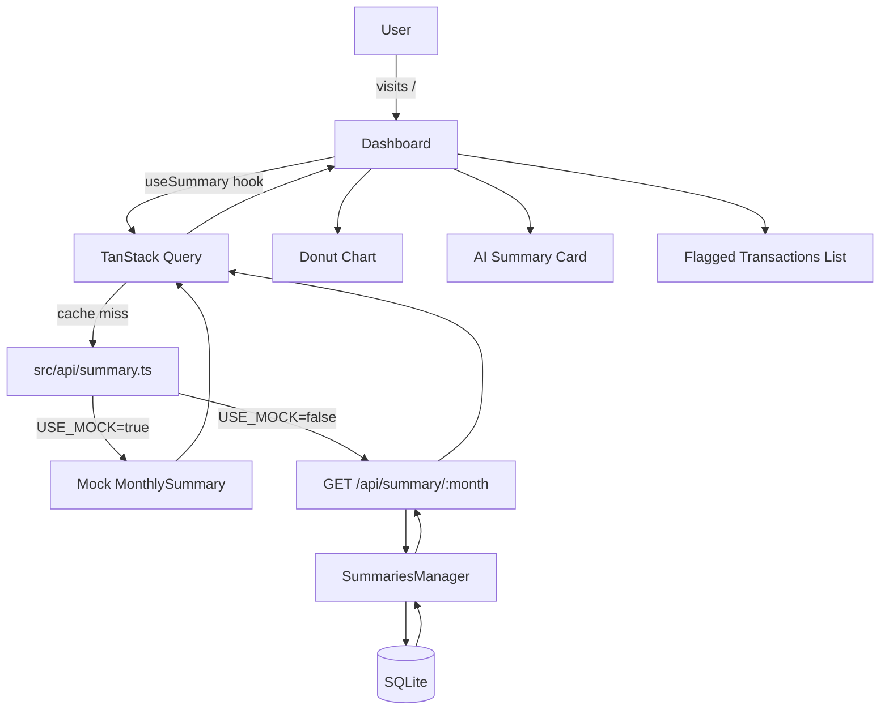
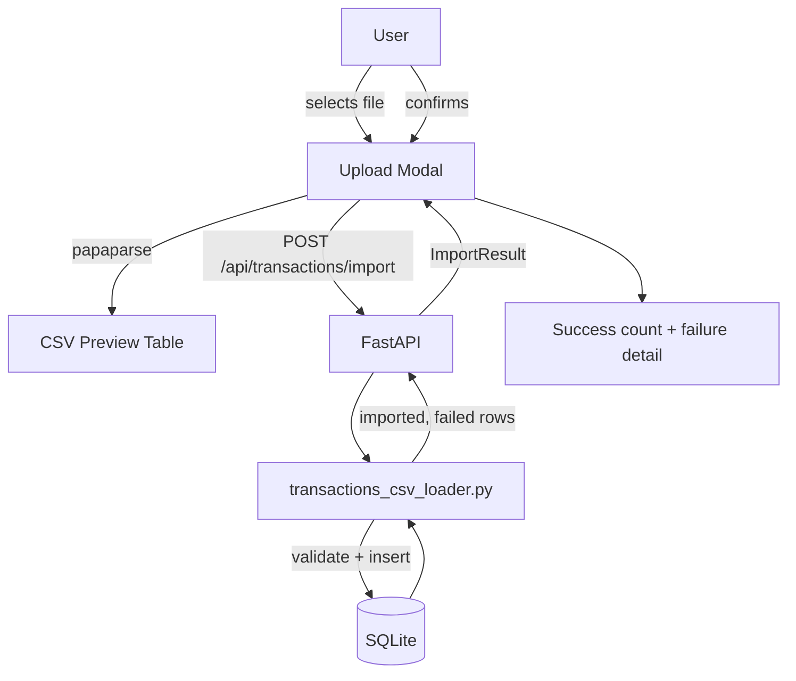

# Architecture

## Overview

Budgy 2.0 adds a React/TypeScript web frontend and a FastAPI HTTP layer on top of the existing Python/SQLite backend. The web UI replaces the PyQt5 desktop UI entirely and covers five areas: dashboard, transactions, categories, analytics, and budget management. The frontend is built mock-first — all pages are fully functional against local mock data before a single FastAPI endpoint exists. When the FastAPI layer is ready, switching a per-resource `USE_MOCK` flag is the only change required. The existing `budgy/database_modules/` package is not touched.

## Tech Stack

| Layer | Choice | Reason |
|---|---|---|
| Frontend language | TypeScript | Type safety for the full API contract and component props |
| Frontend framework | React 18 + Vite | Fast dev server, first-class TypeScript, standard for shadcn/ui |
| Routing | react-router-dom v6 | URL-persisted filters via search params |
| Server state | TanStack Query v5 | Cache, loading/error states, background refetch, no Redux boilerplate |
| Client state | Zustand | Lightweight; only used for theme + sidebar collapse |
| Styling | Tailwind CSS v3 + shadcn/ui (New York, CSS variables) | Consistent design system with dark mode via `darkMode: 'class'` |
| Charts | Recharts + `ResponsiveContainer` | Composable, TypeScript-native, integrates cleanly with React render cycle |
| Forms | React Hook Form + Zod | Performant uncontrolled forms; Zod schema doubles as validation + type source |
| Date utilities | date-fns | Tree-shakeable, no global state, consistent ISO 8601 handling |
| CSV parsing | papaparse | Client-side preview before upload; no server round-trip for parse step |
| Backend HTTP layer | FastAPI + Pydantic v2 | Async-ready, auto-generates OpenAPI, Pydantic handles snake→camel serialization |
| Backend business logic | Existing Python managers (custom ORM) | Unchanged; FastAPI wraps them directly |
| AI integration | Provider-agnostic via env var config | Anthropic/OpenAI interchangeable; prompt constructed from `MonthlySummary` |

## File & Folder Structure

```
budgy_2.0/
├── frontend/                     # React web app (self-contained)
│   ├── src/
│   │   ├── api/                  # One file per resource; USE_MOCK flag per file
│   │   │   ├── transactions.ts
│   │   │   ├── categories.ts
│   │   │   ├── summary.ts
│   │   │   ├── analytics.ts
│   │   │   ├── budgets.ts
│   │   │   └── ai.ts
│   │   ├── components/
│   │   │   ├── ui/               # shadcn/ui primitives (generated, not hand-edited)
│   │   │   ├── charts/           # Recharts wrappers with shared tooltip/formatting
│   │   │   ├── layout/           # Sidebar, header, app shell
│   │   │   └── shared/           # Skeletons, filter controls, modals
│   │   ├── pages/                # Route-level components (one per route)
│   │   │   ├── Dashboard.tsx
│   │   │   ├── Transactions.tsx
│   │   │   ├── Categories.tsx
│   │   │   ├── CategoryDetail.tsx
│   │   │   ├── SubcategoryDetail.tsx
│   │   │   ├── Analytics.tsx
│   │   │   └── Budgets.tsx
│   │   ├── hooks/                # Custom hooks wrapping TanStack Query calls
│   │   ├── store/                # Zustand stores (theme.ts, sidebar.ts)
│   │   ├── types/                # All TypeScript types (index.ts)
│   │   ├── lib/                  # Pure utilities: formatters.ts, utils.ts, budget.ts
│   │   └── __tests__/
│   │       └── fixtures/         # Shared realistic mock dataset for all tests
│   ├── index.html
│   ├── vite.config.ts
│   ├── tailwind.config.ts
│   └── package.json
├── api/                          # FastAPI layer (future session)
│   ├── routers/                  # One router file per resource group
│   ├── models/                   # Pydantic request/response models
│   └── main.py                   # App entry point, router registration
├── budgy/                        # Existing Python backend — do not modify
│   └── database_modules/         # Manager classes, ORM table definitions
├── docs/
│   └── ARCHITECTURE.md
└── tests/                        # Existing Python pytest suite
```

`src/api/` owns all data fetching and the mock/real toggle. `src/lib/` contains only pure functions with no side effects. `src/hooks/` are thin TanStack Query wrappers — no rendering. `api/routers/` are thin HTTP handlers — no business logic.

## Key Components & Responsibilities

### API Layer (`src/api/`)
Owns all data fetching, the `USE_MOCK` flag, mock data generation, and the snake_case → camelCase transform. Each file exports typed async functions consumed by custom hooks. Does **not** contain business logic, component state, or rendering.

### Custom Hooks (`src/hooks/`)
Thin wrappers around TanStack Query that call into `src/api/`. Expose `{ data, isLoading, isError, error }` to page components. Do **not** contain rendering logic or filtering logic.

### Page Components (`src/pages/`)
Own route-level layout and orchestrate sub-components. Read URL search params for active filters. Do **not** call `src/api/` directly — all data access goes through hooks.

### Chart Components (`src/components/charts/`)
Wrap Recharts primitives with consistent tooltip formatting, currency display, and `ResponsiveContainer`. Accept typed data props. Do **not** fetch data or manage state.

### Layout (`src/components/layout/`)
App shell: collapsible sidebar and header. Reads sidebar collapse state from Zustand. Does **not** own page content or data.

### Zustand Stores (`src/store/`)
Two stores only: `theme` (light/dark + localStorage persistence) and `sidebar` (collapsed/expanded). Do **not** hold server data, filter state, or form state.

### Budget Assignment Logic (`src/lib/budget.ts`)
Pure function: `getEffectiveBudget(assignments: BudgetAssignment[], month: string): BudgetAssignment | null`. Returns the assignment with the most recent `effectiveFrom` ≤ `month`. Extracted from UI for isolated unit testing with edge cases.

### FastAPI Routers (`api/routers/`)
Thin HTTP handlers. Parse and validate request params via Pydantic, delegate to existing Python manager classes, serialize responses (Pydantic handles camelCase output via `model_config = ConfigDict(populate_by_name=True)`). Do **not** contain business logic.

### Python Managers (`budgy/database_modules/`)
Unchanged. All database access and business logic lives here. The FastAPI layer calls into these directly.

## Data Flow

### Dashboard Load



### CSV Import



The AI summary card is rendered in full (recap, anomaly badges, suggestion list, regenerate button, loading skeleton, error state) against a hardcoded mock `AISummary`. The `POST /api/ai/summary` stub is already wired in `src/api/ai.ts` — the FastAPI proxy to the AI provider plugs in there without any frontend change.

## API Contracts

All responses use envelope `{ data: T, meta?: { total, page, page_size } }`. Amounts are floats in dollars. Dates are ISO 8601 strings. FastAPI Pydantic models serialize to camelCase.

### GET `/api/transactions`
- **Input**: `page`, `page_size`, `category`, `date_from`, `date_to`, `search`, `sort_by`, `sort_order`, `flagged`
- **Output**: `{ data: Transaction[], meta: { total, page, page_size } }`
- **Errors**: `422` on invalid params

### POST `/api/transactions/import`
- **Input**: multipart `file` (CSV)
- **Output**: `{ data: { imported: number, failed: { row: number, reason: string }[] } }`
- **Errors**: `400` if file is not a valid CSV; `422` if required columns are missing

### GET `/api/summary/:month`
- **Input**: `month` path param (YYYY-MM)
- **Output**: `{ data: MonthlySummary }`
- **Errors**: `404` if no transactions exist for that month

### GET `/api/categories`
- **Output**: `{ data: Category[] }` — only categories present in actual transaction data; zero-transaction detailed categories omitted

### GET `/api/analytics/series`
- **Input**: `date_from`, `date_to` (YYYY-MM)
- **Output**: `{ data: AnalyticsSeries }`

### GET/POST/PUT/DELETE `/api/budgets` and `/api/budgets/:id`
Standard CRUD. `Budget.categoryLimits` serialized from the flat per-column backend schema into `Record<string, number>`.

### GET/POST/DELETE `/api/budgets/assignments` and `/api/budgets/assignments/:id`
`effectiveFrom` is a YYYY-MM string.

### POST `/api/ai/summary`
- **Input**: `{ month: string }`
- **Output**: `{ data: AISummary }`
- **Errors**: `503` if AI provider is unavailable; `504` on timeout
- FastAPI constructs prompt from `MonthlySummary` for the requested month, calls configured provider, parses response into `AISummary` shape.

## State Management

| State | Where | Examples |
|---|---|---|
| Server data + cache | TanStack Query | Transactions, summaries, categories, budgets, analytics |
| Active filters | URL search params | Date range, category, search text, page number, sort |
| UI preferences | Zustand + localStorage | Theme (light/dark), sidebar collapse |
| Modal open/close | Local component state | Upload modal, edit transaction modal |
| Form data | React Hook Form | CSV upload, budget create/edit, transaction edit |

Filter state lives in the URL (not Zustand) so filtered views are bookmarkable and shareable. TanStack Query keys derived from URL params means cache invalidation is automatic when filters change.

## Error Handling Strategy

**API layer**: TanStack Query default retry (3x) on network errors. `isError` and `error` exposed from all hooks; pages render an error card with a retry button in place of chart/data areas.

**Loading states**: Skeleton loaders (not spinners) for all data-dependent areas. Layout does not shift on load.

**CSV import**: Server returns both `imported` count and `failed[]` array with row number and reason. The upload modal renders both inline — partial success is valid and clearly communicated.

**Form validation**: Zod schema runs client-side before submit. Field-level error messages via React Hook Form. Server-side 422 errors map back to form field errors where possible.

**FastAPI errors**: All 4xx/5xx return `{ detail: string }`. Pydantic validation failures return `{ detail: [{ loc, msg, type }] }` (FastAPI default).

**AI endpoint**: Renders a full error state with a retry button. The card does not block the rest of the dashboard — it renders independently.

**Unexpected errors**: React error boundary at the app root catches unhandled render errors and shows a fallback page. FastAPI unhandled exceptions return 500 with a generic message; the real error is logged server-side.

## External Services & Integrations

| Service | Purpose | Auth method | Notes |
|---|---|---|---|
| AI Provider (Anthropic/OpenAI/configurable) | Generate monthly spending recap, anomaly detection, savings suggestions | API key via env var | Provider is a config value in FastAPI; prompt constructed from `MonthlySummary`; `AISummary` response shape is provider-agnostic |

## Decisions & Rationale

### Decision: Mock-first API layer with `USE_MOCK` flag
**Chosen**: `const USE_MOCK = true` at the top of each `src/api/` file; real `fetch()` stub commented directly below each mock return.
**Alternatives considered**: MSW (Mock Service Worker), separate mock server, feature flags in env vars.
**Reason**: One-line change per file to go live. No extra tooling or build config. Mocks and real stubs live side-by-side for easy comparison. MSW adds complexity that isn't needed when the API contract is already fully specified.

### Decision: URL search params for filter state
**Chosen**: `useSearchParams` from react-router-dom for date range, category, search text, page, and sort.
**Alternatives considered**: Zustand, local component state.
**Reason**: Filters are bookmarkable and shareable by design. TanStack Query keys derived from URL params means cache invalidation is automatic. Zustand is not appropriate for state that should survive a page reload or be shareable.

### Decision: Category names as strings, not frontend enums
**Chosen**: `primaryCategory` and `detailedCategory` are plain strings throughout.
**Alternatives considered**: Mirroring the backend Python enums in TypeScript.
**Reason**: The backend may add new categories without a frontend code change. The API returns only categories present in actual data, so the frontend never renders empty buckets. Budget limits attach to category name strings as keys in `Record<string, number>`, matching the backend's column-per-category schema.

### Decision: Budget assignment resolution as a pure function
**Chosen**: `getEffectiveBudget()` in `src/lib/budget.ts` — exported pure function, tested independently.
**Alternatives considered**: Logic inline in the budget page component or inside a custom hook.
**Reason**: The resolution logic (most recent `effectiveFrom` ≤ month) has several edge cases (no assignments, exact match, multiple overlapping, future-dated assignment). Keeping it pure makes it exhaustively testable without rendering components.

### Decision: snake_case → camelCase transform in the API layer
**Chosen**: Transform happens in `src/api/` functions before returning to hooks and components.
**Alternatives considered**: Transform in FastAPI response (Pydantic alias), transform in components.
**Reason**: Components and hooks only ever see camelCase TypeScript types. FastAPI uses Pydantic's `alias_generator` for camelCase output, and the `src/api/` layer types match that output. A single point of transformation prevents inconsistency.

### Decision: Remove PyQt5 UI without migration
**Chosen**: Delete `budgy/UI/` in full. No migration path.
**Alternatives considered**: Keep PyQt5 UI as a fallback during transition.
**Reason**: The new web UI fully replaces all PyQt5 functionality and adds significantly more. Maintaining both would require keeping PyQt5 dependencies and two separate data-access paths with no benefit. The Python backend (managers, database) is the durable asset; the UI layer is not.
